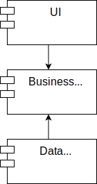
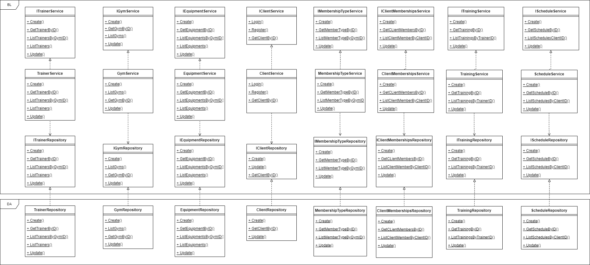

# Web
# Лабораторная №1
## Автор
Тарба Александр Вячеславович
__________
## Название проекта
Интернет-сервис сети тренажерных залов
__________
## Краткое описание идеи проекта
Сервис, предоставляющий пользователям просматривать информацию о спортзалах, их расположении, контактной информации и оборудовании, установленном в них, а так же о тренерах. Пользователи имеют возможность создать личный кабинет, что позволяет им просмотравить их абонементы и записи на тренировки.
__________
## Краткий анализ анологичных решений
|Решение|Личный кабинет|Информация об абонементах|Информация о тренерах|Раписание тренировок|
|---|---|---|---|---|
|World class|+|-|+|+|
|spiritfit|+|+|-|+|
|UFC gym|+|-|-|-|
__________
## Краткое обоснование целесообразности и актуальности проекта
Посещение тренажерных залов на сегодняшней день является важным аспектом жизни многих людей, что позволило им занять свою нишу на рынке услуг. 
В связи с постонно растущим спросом на услуги спортивных центров, разработка приложения, использующего базу данных, для обеспечения работы сети тренажерных залов имеет важное значение для оптимизации управления и предоставления лучшего опыта как для клиентов, так и для персонала зала. 
Автоматизация процесса хранения данных позволяет упростить процесс аналитики и отчетности для владельцев бизнеса, и повысить качество предоставляемого сервиса для клиентов.
__________
## Краткое описание акторов
|Роль|Описание|
|-|-|
|Гость|Неавторизованный посетитель сайта. Может зарегистрироваться, просмотреть список спортзалов, тренеров и оборудования|
|Клиент|Пользователь, зарегистривоваший аккаунт. Может делать то же, что и гость, а также купить абонемент, просмотреть купленные абонементы, записаться на тренировку и просмотреть расписание тренировок. Также может авторизоваться и выйти из аккаунта|
|Админ|Вносит и изменяет информацию об спортзалах,оборудовании и тренерах|
__________
## Usecase-диаграмма
Изображение в svg формате хранится в репозитории

__________
## ER-диаграмма сущность-связь
Изображение в svg формате хранится в репозитории

__________
## Диаграмма БД
Диаграмма базы данных

__________
## Пользовательские сценарии
1. Сценарий просмотра тренажерных залов
   - пользователь заходит в систему;
   - переходит на вкладку "Залы";
   - просматривает содержимое страницы.
2. Сценарий регистрации
   - пользователь заходит в систему;
   - переходит на страницу регистрации;
   - заполняет данные;
   - валидация данных;
   - при успешной валидации, регистрация пользователя и перенаправление его на другую страницу, иначе сообщение пользователю об ошибке.
2. Сценарий входа в личный кабинет
   - пользователь заходит в систему;
   - переходит на страницу авторизации;
   - вводит логин и пароль;
   - при успешной проверке, авторизация пользователя и перенаправление его на другую страницу, иначе сообщение пользователю об ошибке.
3. Сценарий просмотра абонементов
   - пользователь заходит в систему;
   - авторизуется;
   - переходит на вкладку "Ваши абонементы";
   - просматривает доступные абонементы и информацию о них;
4. Сценарий покупи абонементов
   - пользователь заходит в систему;
   - авторизуется;
   - переходит на вкладку "Залы";
   - выбирает интересущий зал и переходит на его страницу;
   - просматривает список абонементов зала, выбирает нужный;
   - покупает выбранный абонемент.
5. Сценарий просмотра тренировок
   - пользователь заходит в систему;
   - авторизуется;
   - переходит на вкладку "Ваши тренировки";
   - просматривает расписание тренировок и информацию о них;
6. Сценарий записи на тренировку
   - пользователь заходит в систему;
   - авторизуется;
   - переходит на вкладку "Залы";
   - выбирает интересущий зал и переходит на его страницу;
   - просматривает список трениров зала, выбирает нужного;
   - записывается у тренера на тренировку.

__________
## Формализация ключевых бизнес-процессов

## Верхнеуровневое разбиение на компоненты
### Верхнеуровневая схема разбияния на компоненты

### Ожидаемые пакеты
- Слой BL:
  - package entity - сущности предметной области
  - package service - бизнес-правила приложения + интерфейсы репозиториев для соблюдения инверсии зависимостей
- Слой DA:
  - package repository - реализация паттерна репозиторий
  - package db_models - модели базы данных, предполагается использовать ORM
- Слой UI:
   - package handlers - обработчики HTTP запросов "ручек"
   - package server - сервер, принимающий запросы
   - package api - основное приложение, предоставляющее API сервиса (запускает сервер)

Также возможно написания дополнительных пакетов, например, читающих конфиги, хеширующие пароли, валидаторы и так далее.
__________
## UML-диаграмма классов
Изображение в svg формате хранится в репозитории

